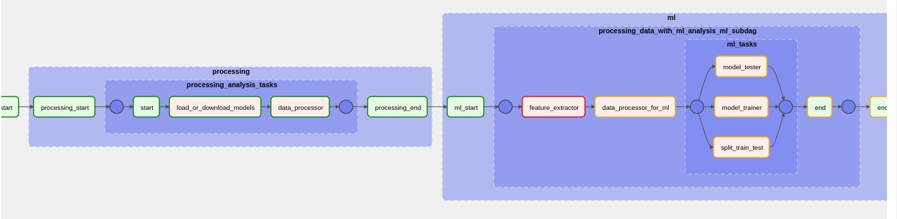

# General system flow

# To run the project, we need to follow these steps:

### Option1:
    Run using google colab:
    Use link: https://colab.research.google.com/drive/1tL_sVswAplZlZ9TbGVMZQ5YtZFWqOtC-?usp=sharing
### Option2:
    1. Navigate to the notebook directory and run the `data_ml_pipeline.ipynb` make sure to have the requirements in the `requirements.txt` file installed before running.

### Option3:
    1. Clone the repository to your local machine: `git clone https://github.com/vincycode7/cyder-test.git`
    2. Change directory into the project: cd your_project
    3. Create a virtual environment using pipenv (optional)
    4. install requirements using `pipenv install` or `pip install requirements`
    5. If you used pipenv virtual environment activate using `pipenv shell`
    6. Create a .env file using the .env.example format and set the following variables:
            i. `AIRFLOW_HOME=/absolute/path/to/the/project/locally`
            ii. `AIRFLOW__CORE__DAGS_FOLDERS=${AIRFLOW_HOME}/dags`
            iii. `AIRFLOW__CORE__PLUGINS_FOLDERS=${AIRFLOW_HOME}/plugins`
    7. If this is your first time running the project, type init db in the terminal to initialize the database.
    8. If this is your first time running the project, type `airflow users create --username admin --firstname FIRST_NAME --lastname LAST_NAME --role Admin --email admin@example.org` to create an admin user feel free to change the values.
    9. Run the webserver with `airflow webserver -p 8080`.
    10. Open a second terminal while the first one is still running.
    11. Run `airflow scheduler`.
    12. Open your browser and navigate to http://localhost:8080
    13. Login to the UI with your username and password, which are `admin` and `admin`.
    14. in the search bar type `processing_data_with_ml_analysis` 
    15. Once you get the dag and click on the play/run icon by the top-right corner to select trigger to run the dag
    16. Click on the `graph` button to watch dag run and check the displayed status
    17. Done

### Option4:
    Running the Docker container
    1. Clone the repository to your local machine: `git clone https://github.com/vincycode7/cyder-test.git`
    2. Change directory into the project: cd your_project
    3. Build the Docker image: docker build -t your_image_name .
    3. Run the Docker container: docker run -p 8080:8080 your_image_name
    4. Open your browser and navigate to http://localhost:8080
    5. Login to the UI with your username and password, which are admin and admin.
    6. in the search bar type `processing_data_with_ml_analysis`
    7. Once you get the dag and click on the play/run icon by the top-right corner to select trigger to run the dag
    8. Click on the graph button to watch dag run and check the displayed status
    9. Done

# Presentation:
    Use link to access slides: https://docs.google.com/presentation/d/1FMASxynigOSQkRXoiPDQtHRwvymuZMaP8BAAsIYukXE/edit?usp=sharing
    
# Solution Summary:

### 1.  Q: Remove any personally identifiable information from the dataset

    A: To remove personally identifiable information, we need to identify the columns that contain such information. From the given data, the columns "userId" and "ip" contain personally identifiable information. We can drop or mask them out these columns using the pandas library.

### 2.  Q: Using the data, derive any demographic or interest-based attributes about the individual

    A: To derive demographic or interest-based attributes, we need to analyze the remaining columns of the dataset. We can use techniques like data visualization, statistical analysis, and machine learning algorithms to derive such attributes.

### 3.  Q: Identify products the person is interested in.

    A: We can use natural language processing techniques to analyze the metadata content column to identify products the person is interested in.

### 4.  Q: Explain how you would know if this person is interested in a new product.

    A: We can track the frequency and recency of the person's visits to a particular product's website to determine if the person is interested in a new product.

### 5.  Q: Is this person interested in or was browsing financial products? (Loans, Credit Cards, Mortgages, etc.)

    A: We can use the domains visited by the person to identify if they were interested in or browsing financial products.

### 6.  Q: How would you improve accuracy if you had more time

    A: We can improve accuracy by collecting more data, using more advanced machine learning algorithms, and performing feature engineering to extract more relevant features from the data.

### 7.  Q: What other data would you want collected that chrome extensions can collect that can enforce the model.

    A: 
        
        i. Browser history: This would allow the model to gain insights into the user's browsing behavior, which could inform the types of ads they are likely to engage with.

        ii. Time spent on pages: By tracking how long users spend on particular pages, the model could infer how engaged they are with different types of content and adjust its recommendations accordingly.

        iii. Clickstream data: By analyzing the links that users click on, the model could gain insights into their interests and use that information to make more personalized ad recommendations.

        iv. Search history: By analyzing the user's search history, the model could gain insights into their intent and use that information to make more targeted ad recommendations.

        v. Social media activity: By monitoring the user's social media activity, the model could gain insights into their interests, relationships, and social network, which could inform more personalized ad recommendations.
